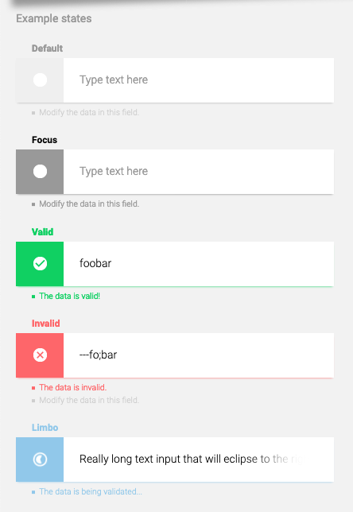

web-stack-task-component
======================

The purpose of this task is to demonstrate well-rounded knowledge of core Web technologies. Given that Web sites and Web apps are the result of a culmination of mutliple technologies working together&mdash;namely HTML, CSS, and JavaScript&mdash;successful completion of this task, then, will cohesively demonstrate the strong relationship of them all working together.

## A Dynamic input component

Create a dynamic input that accepts only `letters` and `numbers`, with a minimum length of `3`. This dynamic input will validate the string typed into it and provide immediate, inline feedback to the end-user. A minimum of four states, being `Default`, `Focus`, `Valid`, and `Invalid` must be covered; an optional fifth state, `Limbo`, can be provided, representing the time between a string being typed into the input and its validated state of either `Valid` or `Invalid`. Note that the `Default` and `Focus` states are simply states that exist before any focus is provided or text typed and validated. 

Example strings that will result in a `Valid` state:

- "foobar"
- "foobar123"
- "foo"
- "112"

Example strings that will result in an `Invalid` state (note the whitespaces):

- "foobar!"
- "    foobar123"
- "fo"
- "---fo;bar "

The strings provided are by no means exhaustive, and based on the validation requirements provided, the actual combination of strings that can be `Valid` or `Invalid` are incalculaby large.

### The end result

The end result should look and behave similar to the screenshot below. If it is not clear, the five inputs below are simply for demonstration purposes; the end result will be one input that can only be in one of these states at a time. 

### Details that will be noticed

Everything will be noticed, but certain details expose a deeper expertise or appreciation of the craft, so feel free to indulge.

- Use of HTML semantics
- Graceful handling of excessively long text or unsually cramped dimensions via CSS
- JavaScript event handling
- Naming of things and conciseness across the stack
- Documentation and use of `git`

### Provide source and host the result

The source code for this task should be accessible from an online service, like [GitHub](https://github.com) or similar. The result should be hosted somewhere online. Use what works best. GitHub and static hosting services like [GitHub Pages](https://docs.github.com/en/pages/getting-started-with-github-pages/about-github-pages) are only recommendations.

# Author of this task

Dane MacMillan

